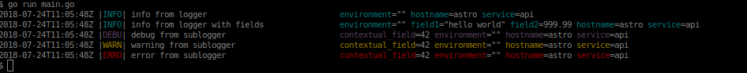

## Astro

[](https://godoc.org/github.com/astroflow/astro-go)
[](https://github.com/astroflow/astro-go/releases)



```go
package main

import (
	"os"

	"github.com/astroflow/astro-go"
	"github.com/astroflow/astro-go/log"
)

func main() {

	env := os.Getenv("GO_ENV")
	hostname, _ := os.Hostname()

	log.Init(
		//   astro.SetWriter(os.Stderr),
		astro.AddWith(
			"service", "api",
			"host", hostname,
			"environment", env,
		),
		astro.SetFormatter(astro.NewConsoleFormatter()),
	)

	if env == "production" {
		log.Config(
			astro.SetFormatter(astro.JSONFormatter{}),
			astro.SetLevel(astro.InfoLevel),
		)
	}

	subLogger := log.With("contextual_field", 42)

	log.Info("info from logger")
	log.With("field1", "hello world", "field2", 999.99).Info("info from logger with fields")
	subLogger.Debug("debug from sublogger")
	subLogger.Warn("warning from sublogger")
	subLogger.Error("error from sublogger")
}
```

## Log
```go
import (
    "github.com/astroflow/astro-go/log"
)

log.Init(options ...astro.LoggerOption) error
log.Config(options ...astro.LoggerOption) error
log.With(fields ...interface{}) astro.Logger
log.Debug(message string)
log.Info(message string)
log.Warn(message string)
log.Error(message string)
log.Fatal(message string) // log with the "fatal" level then os.Exit(1)
```

## Configuration

```go
SetWriter(writer io.Writer) // default to os.Stdout
SetFormatter(formatter astro.Formatter) // default to astro.JSONFormatter
SetWith(fields ...interface{})
SetInsertTimestampField(insert bool) // default to true
SetLevel(level Level) // default to astro.DebugLevel
SetTimestampFieldName(fieldName string) // default to astro.TimestampFieldName ("timestamp")
SetLevelFieldName(fieldName string) // default to astro.LevelFieldName ("level")
SetTimestampFunc(fn func() time.Time) // default to time.Now().UTC
AddHook(hook astro.Hook)
```
